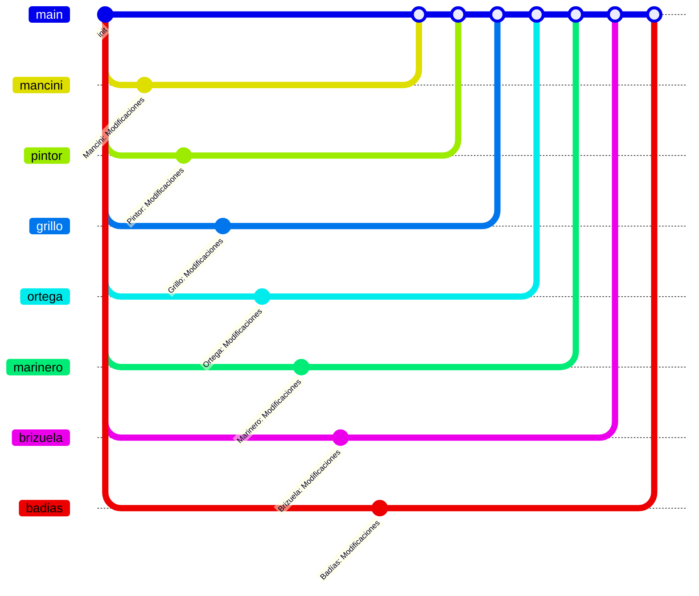

# Estructura de versiones del proyecto TEAssist
Este documento describe la estructura de versiones del proyecto TEAssist.
## Contexto
El proyecto TEAssist es un proyecto de desarrollo de software que se da en el contexto de la asignatura de Desarrollo Backend I de la carrera Tecnicatura Universitaria en Programación Web de la Universidad Nacional de San Juan. El equipo de desarrollo está compuesto por ocho estudiantes de la carrera mencionada. 
## Objetivo
El objetivo del proyecto es desarrollar una aplicación web que permita a los estudiantes de la carrera gestionar sus tareas y proyectos de manera eficiente.
A tal efecto, y dado que se espera que cada estudiante aprenda en forma individual y en equipo, se ha definido una estructura de versiones que permita a cada estudiante trabajar en forma independiente y en equipo al mismo tiempo.
## Estructura de versiones
Cada estudiante trabajará en una rama independiente del proyecto. La rama principal del proyecto se llama `main` y es la rama que verá el cliente. Cada estudiante trabajará en una rama que llevará el apellido en minúsculas, sin espacios ni caracteres especiales.
El docente de la asignatura será el encargado de fusionar las ramas de los estudiantes en la rama `main` del proyecto, de manera que el cliente pueda ver el avance del proyecto.
## Estilos visuales y propuestas
Los estilos visuales y propuestas estarán a cargo de cada estudiante. Cada estudiante propondrá un estilo visual para la aplicación y el docente de la asignatura seleccionará uno de ellos para ser utilizado en el proyecto, en función de la coherencia con el objetivo del proyecto, la calidad del diseño y la elección del cliente.
Asimismo, cada estudiante propondrá una funcionalidad para la aplicación y el docente de la asignatura seleccionará una de ellas para ser implementada en el proyecto, en función de la coherencia con el objetivo del proyecto, la calidad del diseño y la elección del cliente.
## Diagrama de versiones


## Configuración Inicial

### 1. Configuración del Repositorio

```bash
# Clonar el repositorio
git clone https://github.com/eormeno/teassist.git

# Configurar usuario y email
git config user.name "Tu Nombre"
git config user.email "tu@email.com"

# Crear tu rama de trabajo con tu apellido (en minúsculas, sin espacios ni caracteres especiales)
git checkout -b apellido main
git push -u origin develop
```

### 2. Instalación del Proyecto

```bash
# Ingresar al directorio del proyecto
cd teassist/src

# Instalar dependencias
composer install
npm install

# Configurar entorno
cp .env.example .env
php artisan key:generate
php artisan storage:link

# Crear base de datos local
php artisan migrate --seed --force
```
