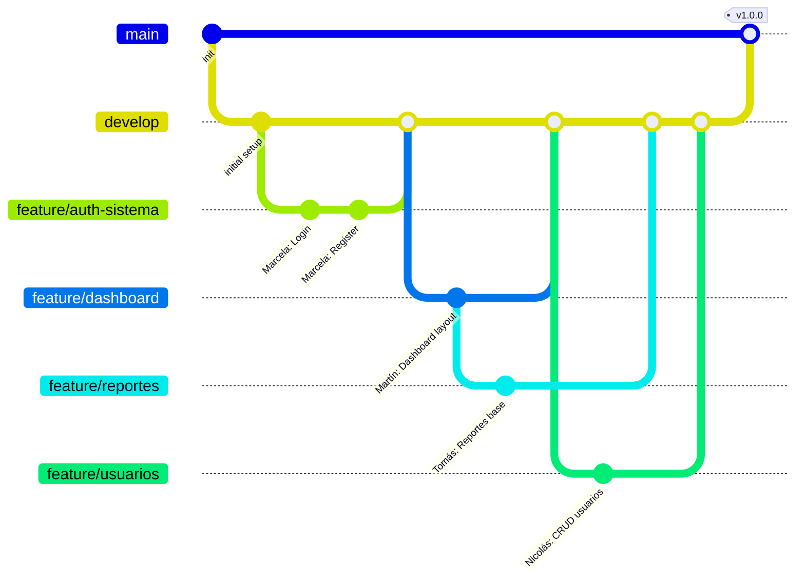

# Guía de Colaboración con Git para Proyectos Laravel

## Índice
1. [Configuración Inicial](#configuración-inicial)
2. [Estructura de Ramas](#estructura-de-ramas)
3. [Flujo de Trabajo](#flujo-de-trabajo)
4. [Resolución de Pull Requests](#resolución-de-pull-requests)
5. [Situaciones Comunes y Soluciones](#situaciones-comunes-y-soluciones)
6. [Buenas Prácticas](#buenas-prácticas)
7. [Diagrama de Flujo de Trabajo](#diagrama-de-flujo-de-trabajo)

## Configuración Inicial

### 1. Configuración del Repositorio

```bash
# Clonar el repositorio
git clone https://github.com/usuario/proyecto-laravel.git

# Configurar usuario y email
git config user.name "Tu Nombre"
git config user.email "tu@email.com"

# Crear rama develop
git checkout -b develop main
git push -u origin develop
```

### 2. Instalación del Proyecto

```bash
# Instalar dependencias
composer install
npm install

# Configurar entorno
cp .env.example .env
php artisan key:generate

# Crear base de datos local
php artisan migrate
```

## Estructura de Ramas

- `main`: Rama principal (producción)
- `develop`: Rama de desarrollo
- Feature branches:
  - `feature/auth-sistema` (Marcela)
  - `feature/dashboard` (Martín)
  - `feature/reportes` (Tomás)
  - `feature/usuarios` (Nicolás)

## Flujo de Trabajo

### 1. Crear rama de feature
```bash
# Nos movemos a la rama develop para asegurarnos de partir del último estado estable
git checkout develop

# Actualizamos develop con los últimos cambios del repositorio remoto
git pull origin develop

# Creamos y nos movemos a una nueva rama para nuestra feature
git checkout -b feature/auth-sistema
```

**¿Qué está pasando?**
- `git checkout develop`: Nos movemos a la rama develop, que contiene la versión más reciente del código en desarrollo
- `git pull origin develop`: Descargamos los últimos cambios que otros miembros del equipo hayan subido a develop
- `git checkout -b feature/auth-sistema`: Creamos (-b) y nos movemos a una nueva rama llamada feature/auth-sistema

**Ejemplo práctico:**
Marcela va a trabajar en el sistema de autenticación. Antes de empezar, ejecuta estos comandos para asegurarse de que está trabajando sobre la última versión del código y en su propia rama.

### 2. Realizar commits frecuentes
```bash
# Ver el estado de nuestros archivos
git status

# Agregar archivos específicos
git add resources/views/auth/login.blade.php
git add resources/views/auth/register.blade.php

# O agregar todos los cambios
git add .

# Crear un commit con un mensaje descriptivo
git commit -m "feat: Implementación de login con Laravel Breeze"
```

**¿Qué está pasando?**
- `git status`: Muestra qué archivos han sido modificados, agregados o eliminados
- `git add`: Prepara los cambios para ser incluidos en el próximo commit
  - `git add archivo.php`: Agrega un archivo específico
  - `git add .`: Agrega todos los archivos modificados
- `git commit -m "mensaje"`: Crea un punto de guardado con los cambios preparados

**Ejemplo práctico:**
Martín está trabajando en el dashboard y ha creado nuevos componentes:
```bash
git status  # Ve que modificó 3 archivos de Blade
git add resources/views/dashboard/*  # Agrega todos los archivos del dashboard
git commit -m "feat: Agregados widgets de estadísticas al dashboard"
```

### 3. Actualizar rama feature con develop
```bash
# Guardamos nuestros cambios locales (opcional)
git stash

# Nos movemos a develop y actualizamos
git checkout develop
git pull origin develop

# Volvemos a nuestra rama
git checkout feature/auth-sistema

# Traemos los cambios de develop
git merge develop

# Recuperamos nuestros cambios guardados (si usamos stash)
git stash pop
```

**¿Qué está pasando?**
- `git stash`: Guarda temporalmente nuestros cambios no committeados
- `git checkout develop`: Nos movemos a la rama develop
- `git pull origin develop`: Actualizamos develop con los últimos cambios
- `git merge develop`: Incorporamos los cambios de develop a nuestra rama feature
- `git stash pop`: Recuperamos los cambios que habíamos guardado

**Ejemplo práctico:**
Tomás está trabajando en reportes, pero Nicolás acaba de agregar nuevas funcionalidades de usuarios que Tomás necesita:
```bash
git stash  # Guarda sus cambios actuales en reportes
git checkout develop
git pull origin develop  # Obtiene las nuevas funcionalidades de usuarios
git checkout feature/reportes
git merge develop  # Incorpora las nuevas funcionalidades a su rama
git stash pop  # Recupera sus cambios en reportes
```

### 4. Subir cambios
```bash
# Verificar que estamos en la rama correcta
git branch

# Verificar el estado de nuestros cambios
git status

# Subir nuestra rama al repositorio remoto
git push origin feature/auth-sistema
```

**¿Qué está pasando?**
- `git branch`: Muestra todas las ramas y marca en cuál estamos
- `git status`: Verificamos que no hay cambios sin commitear
- `git push origin feature/auth-sistema`: Sube nuestros commits al repositorio remoto

**Ejemplo práctico:**
Nicolás ha terminado una función de búsqueda de usuarios y quiere compartirla:
```bash
git branch  # Verifica que está en feature/usuarios
git status  # Verifica que todos sus cambios están committeados
git push origin feature/usuarios  # Sube sus cambios
```

### 5. Crear Pull Request (en GitHub/GitLab)

Después de subir los cambios, creamos un Pull Request (PR) para integrar nuestra rama a develop:

1. Ir al repositorio en GitHub/GitLab
2. Crear nuevo Pull Request
3. Seleccionar nuestra rama feature como origen y develop como destino
4. Agregar:
   - Título descriptivo
   - Descripción de los cambios
   - Screenshots si hay cambios visuales
   - Mencionar a revisores (@Marcela, @Martin, etc.)

**Ejemplo práctico:**
Martín ha terminado el dashboard y crea un PR:
- Título: "Feature: Dashboard con widgets de estadísticas"
- Descripción: 
  ```
  - Agregados widgets para:
    - Usuarios activos
    - Ventas del mes
    - Reportes pendientes
  - Implementada actualización en tiempo real
  - Agregados tests para los componentes

  @Marcela @Tomas por favor revisar la integración con el sistema de usuarios
  ```

## Resolución de Pull Requests

### Como Autor
1. Estar pendiente de los comentarios
2. Responder a todas las observaciones
3. Hacer los cambios solicitados:
```bash
git checkout feature/dashboard
# Hacer cambios
git add .
git commit -m "fix: Ajustes según review del PR"
git push origin feature/dashboard
```

### Como Revisor
1. Revisar el código
2. Probar la funcionalidad localmente:
```bash
git fetch origin
git checkout feature/dashboard
composer install # Si hay nuevas dependencias
npm install # Si hay nuevos paquetes JS
php artisan migrate # Si hay nuevas migraciones
```
3. Aprobar o solicitar cambios

[El resto de las secciones se mantienen igual...]

## Situaciones Comunes y Soluciones

### 1. Conflicto en archivo de vistas Blade

**Situación:** Marcela y Martín modificaron el mismo archivo `resources/views/layout.blade.php`

**Solución:**
```bash
# Martín debe actualizar su rama
git checkout develop
git pull origin develop
git checkout feature/dashboard
git merge develop

# Si hay conflictos
git status
# Editar archivos con conflictos
# Resolver manualmente en el editor
git add resources/views/layout.blade.php
git commit -m "merge: Resueltos conflictos en layout"
```

### 2. Revertir un commit erróneo

**Situación:** Tomás subió cambios que rompieron las migraciones

```bash
# Identificar el commit problemático
git log

# Revertir el commit
git revert 1234abc
git push origin feature/reportes
```

### 3. Cambios en archivo .env

**Situación:** Nicolás necesita agregar nuevas variables de entorno

```bash
# Actualizar .env.example
git checkout feature/usuarios
# Agregar variables en .env.example
git add .env.example
git commit -m "chore: Agregadas nuevas variables de entorno para API"
```

## Buenas Prácticas

### 1. Convenciones de Commits

- `feat:` Nueva característica
- `fix:` Corrección de bug
- `docs:` Cambios en documentación
- `style:` Cambios de formato, estilos
- `refactor:` Refactorización de código
- `test:` Agregando o modificando tests
- `chore:` Tareas de mantenimiento

### 2. Reglas de Ramas

- Nunca hacer commit directo a `main` o `develop`
- Mantener las ramas de feature actualizadas con `develop`
- Eliminar ramas de feature después del merge

### 3. Pull Requests

- Incluir descripción clara del cambio
- Agregar screenshots si hay cambios visuales
- Solicitar review de al menos un compañero
- Resolver todos los comentarios antes del merge

### 4. Manejo de Archivos

- No hacer commit de `/vendor` o `/node_modules`
- No subir archivos `.env`
- Mantener `composer.lock` y `package-lock.json` en el repositorio

## Diagrama de Flujo de Trabajo
El siguiente diagrama muestra cómo se estructuran las ramas en el repositorio y cómo se integran los cambios de cada miembro del equipo.

