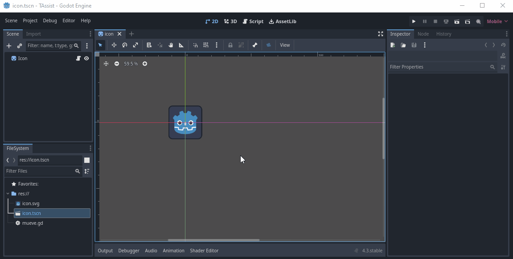
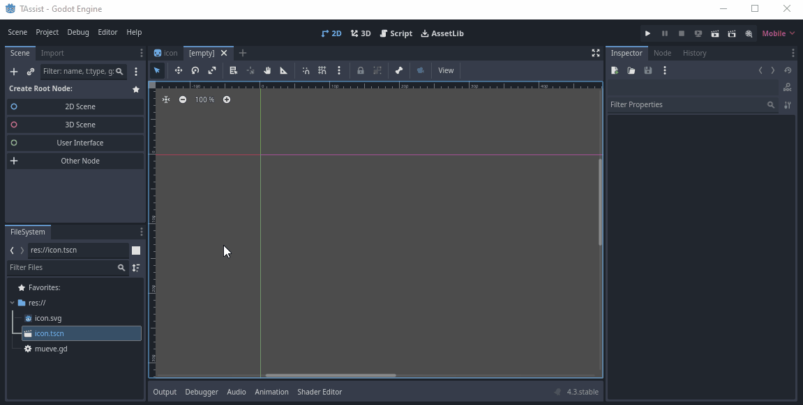
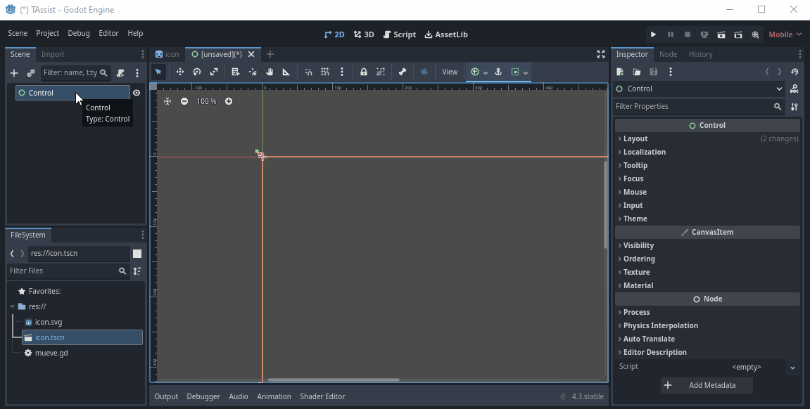

# Crear un cliente de Android para TEAssist en Godot
## Introducción
En este tutorial mostraré cómo crear la funcionalidad de un cliente de Android para TEAssist en Godot que consta de dos escenas:
- Escena principal que dará acceso a las actividades disponibles para el usuario: `MainScene.tscn` y
- Una ventana de diálogo llamada `CodeInputDialog.tscn` que solicitará un código con un formato específico y lo validará contra un Endpoint HTTP.

El flujo de la aplicación será el siguiente:

1. Verifcar la existencia de un código de usuario almacenado.
2. Si el código existe, mostrará la escena principal. De lo contrario, si no está almacenado, mostrará la ventana de diálogo que solicite ese código, lo validará contra un Endpoint HTTP y, si es correcto, lo almacenará y mostrará una escena principal.

## Pasos
Para lograr esto en Godot, puedes seguir estos pasos:
1. Crear una nueva escena para la aplicación principal.
2. Crear una nueva escena para el diálogo de entrada de código.
3. Escribir un script para manejar la lógica de verificación del código almacenado, mostrar el diálogo de entrada si es necesario, validar el código y hacer la transición a la escena principal.

Aquí tienes una guía paso a paso:

### Paso 1: Crear la escena principal
1. Crear una nueva escena.

2. Define a la escena como "User Interface", lo cual establecerá un nodo `Control` como raíz.

3. Agregar los elementos de la interfaz de usuario que desees para tu aplicación principal.

4. Guardar la escena con el nombre `MainScene.tscn`.


### Step 2: Create the Code Input Dialog Scene

1. Create a new scene and save it as `CodeInputDialog.tscn`.
2. Add a `WindowDialog` node as the root.
3. Add a `LineEdit` node for the user to input the code.
4. Add a `Button` node for the user to submit the code.

### Step 3: Write the Script

Create a new script and attach it to a root node (e.g., `Node`) in your main scene. Save it as `Main.gd`.

```gdscript
extends Node

const CODE_STORAGE_KEY = "user_code"
const VALIDATION_URL = "https://example.com/validate_code"

var http_request: HTTPRequest

func _ready():
    http_request = HTTPRequest.new()
    add_child(http_request)
    http_request.connect("request_completed", self, "_on_request_completed")
    
    if not has_stored_code():
        show_code_input_dialog()
    else:
        load_main_scene()

func has_stored_code() -> bool:
    return OS.has_environment(CODE_STORAGE_KEY)

func get_stored_code() -> String:
    return OS.get_environment(CODE_STORAGE_KEY)

func store_code(code: String):
    OS.set_environment(CODE_STORAGE_KEY, code)

func show_code_input_dialog():
    var dialog = preload("res://CodeInputDialog.tscn").instance()
    add_child(dialog)
    dialog.connect("code_submitted", self, "_on_code_submitted")

func _on_code_submitted(code: String):
    validate_code(code)

func validate_code(code: String):
    var url = VALIDATION_URL + "?code=" + code
    http_request.request(url)

func _on_request_completed(result, response_code, headers, body):
    if response_code == 200:
        var response = JSON.parse(body.get_string_from_utf8())
        if response.result == "valid":
            store_code(response.code)
            load_main_scene()
        else:
            show_code_input_dialog()
    else:
        show_code_input_dialog()

func load_main_scene():
    var main_scene = preload("res://MainScene.tscn").instance()
    get_tree().change_scene_to(main_scene)
```

### Step 4: Code Input Dialog Script

Create a new script and attach it to the `WindowDialog` node in `CodeInputDialog.tscn`. Save it as `CodeInputDialog.gd`.

```gdscript
extends WindowDialog

signal code_submitted(code: String)

onready var code_input = $LineEdit
onready var submit_button = $Button

func _ready():
    submit_button.connect("pressed", self, "_on_submit_button_pressed")

func _on_submit_button_pressed():
    var code = code_input.text
    emit_signal("code_submitted", code)
    queue_free()
```

### Step 5: Connect the Scenes

Make sure to connect the scenes properly in your project settings and ensure the paths in the scripts are correct.

Now, when you run the project, it will check for a stored user code, display the input dialog if necessary, validate the code against an HTTP endpoint, store it if valid, and then show the main scene.