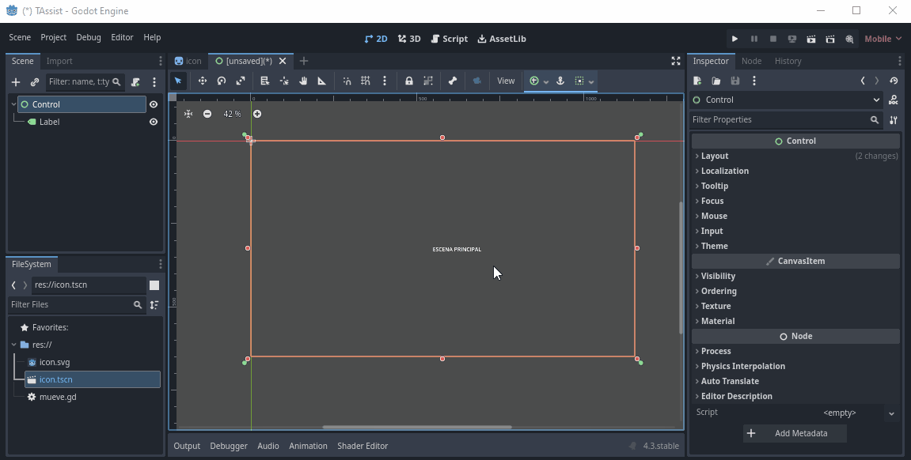

# Crear un cliente de Android para TEAssist en Godot

## Introducción
En este tutorial mostraré cómo crear la funcionalidad de un cliente de Android para TEAssist en Godot que consta de tres escenas:
- Escena principal que dará acceso a las actividades disponibles para el usuario: `MainScene.tscn` y
- Escena de diálogo llamada `CodeInputDialog.tscn` que solicitará un código con un formato específico y lo validará contra un Endpoint HTTP.
- Escena inicial que verificará si el código de usuario está almacenado y, si no lo está, mostrará la escena de diálogo para ingresar el código, o si ya está almacenado, mostrará la escena principal.

## Pasos
Para lograr esto en Godot, puedes seguir estos pasos:
1. Crear una nueva escena para la aplicación principal.
2. Crear una nueva escena para el diálogo de entrada de código.
3. Escribir un script para manejar la lógica de verificación del código almacenado, mostrar el diálogo de entrada si es necesario, validar el código y hacer la transición a la escena principal.

Aquí tienes una guía paso a paso:

### Paso 1: Crear la escena principal
1. Crear una nueva escena.

2. Define a la escena como "User Interface", lo cual establecerá un nodo `Control` como raíz.

3. Agregar los elementos de la interfaz de usuario que desees para tu aplicación principal.

4. Guardar la escena con el nombre `MainScene.tscn`.


### Paso 2: Crear la escena para el ingreso del código

1. Crear una nueva escena.
2. Selecciona un nodo `Control` como raíz.
3. Agrega un componente `Panel` para el fondo del diálogo.
4. Dentro del panel, agrega un `VBoxContainer` para alinear verticalmente los elementos.
5. Dentro del `VBoxContainer`, agrega un `Label` para mostrar instrucciones al usuario.
6. Agrega un nodo `LineEdit` para que el usuario ingrese el código.
7. Agrega un nodo `Label` para mostrar un mensaje de error si el código es inválido.
8. Agrega un nodo `Button` para que el usuario envíe el código.
9. Guardar la escena con el nombre `CodeInputDialog.tscn`.

Al finalizar, la escena debería verse algo así:


Y su estructura de nodos sería la siguiente:


#### Descripción de los Componentes

- **Nodo `Center` (Control)**
Este nodo actúa como un contenedor centralizado para los elementos de la interfaz. Utiliza anclajes para posicionarse en el centro de su contenedor padre.

- **Nodo `Panel` (Panel)**
El nodo `Panel` es un contenedor visual que se utiliza para agrupar otros elementos de la interfaz. Está configurado para tener un tamaño mínimo y está centrado dentro de su contenedor padre.

- **Nodo `VBoxContainer` (VBoxContainer)**
El nodo `VBoxContainer` es un contenedor que organiza sus hijos en una columna vertical. Está configurado para crecer horizontal y verticalmente dentro de su contenedor padre.

- **Nodo `Label` (Label)**
El nodo `Label` muestra un texto en la interfaz. Está configurado para tener un tamaño mínimo y el texto está centrado y en mayúsculas.

- **Nodo `LineEdit` (LineEdit)**
El nodo `LineEdit` permite la entrada de texto por parte del usuario. Está configurado para ajustarse al diseño de su contenedor padre y tiene un texto de marcador de posición, una longitud máxima de 6 caracteres, y selecciona todo el texto al recibir el foco.

- **Nodo `ErrorLabel` (Label)**
El nodo `ErrorLabel` muestra mensajes de error en la interfaz. Está configurado para tener un color de fuente rojo y el texto está centrado y en mayúsculas.

- **Nodo `Button` (Button)**
El nodo `Button` es un botón interactivo que permite al usuario enviar el código ingresado. Está configurado para tener un tamaño mínimo y el texto está centrado y en mayúsculas.

##### Recurso `Dialog.tres` (StyleBoxFlat)
Este recurso define el estilo visual del panel, incluyendo márgenes, color de fondo, bordes, esquinas redondeadas y sombras. Constiste en un `StyleBoxFlat`que puede ser reutilizado en otros elementos de la interfaz.

### Paso 3: Script de la escena inicial
Para manejar la lógica de verificación del código almacenado, mostrar el diálogo de entrada si es necesario, validar el código y hacer la transición a la escena principal, crea un nuevo script y adjúntalo a un nodo raíz (por ejemplo, `Node`) en tu escena principal. Guárdalo como `Main.gd`.

```gdscript

Create a new script and attach it to a root node (e.g., `Node`) in your main scene. Save it as `Main.gd`.

```gdscript
extends Node

const CODE_STORAGE_KEY = "user_code"
const VALIDATION_URL = "https://example.com/validate_code"

var http_request: HTTPRequest

func _ready():
    http_request = HTTPRequest.new()
    add_child(http_request)
    http_request.connect("request_completed", self, "_on_request_completed")
    
    if not has_stored_code():
        show_code_input_dialog()
    else:
        load_main_scene()

func has_stored_code() -> bool:
    return OS.has_environment(CODE_STORAGE_KEY)

func get_stored_code() -> String:
    return OS.get_environment(CODE_STORAGE_KEY)

func store_code(code: String):
    OS.set_environment(CODE_STORAGE_KEY, code)

func show_code_input_dialog():
    var dialog = preload("res://CodeInputDialog.tscn").instance()
    add_child(dialog)
    dialog.connect("code_submitted", self, "_on_code_submitted")

func _on_code_submitted(code: String):
    validate_code(code)

func validate_code(code: String):
    var url = VALIDATION_URL + "?code=" + code
    http_request.request(url)

func _on_request_completed(result, response_code, headers, body):
    if response_code == 200:
        var response = JSON.parse(body.get_string_from_utf8())
        if response.result == "valid":
            store_code(response.code)
            load_main_scene()
        else:
            show_code_input_dialog()
    else:
        show_code_input_dialog()

func load_main_scene():
    var main_scene = preload("res://MainScene.tscn").instance()
    get_tree().change_scene_to(main_scene)
```

### Step 4: Code Input Dialog Script

Create a new script and attach it to the `WindowDialog` node in `CodeInputDialog.tscn`. Save it as `CodeInputDialog.gd`.

```gdscript
extends WindowDialog

signal code_submitted(code: String)

onready var code_input = $LineEdit
onready var submit_button = $Button

func _ready():
    submit_button.connect("pressed", self, "_on_submit_button_pressed")

func _on_submit_button_pressed():
    var code = code_input.text
    emit_signal("code_submitted", code)
    queue_free()
```

### Step 5: Connect the Scenes

Make sure to connect the scenes properly in your project settings and ensure the paths in the scripts are correct.

Now, when you run the project, it will check for a stored user code, display the input dialog if necessary, validate the code against an HTTP endpoint, store it if valid, and then show the main scene.