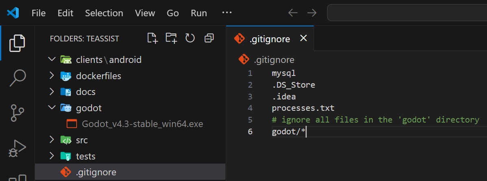
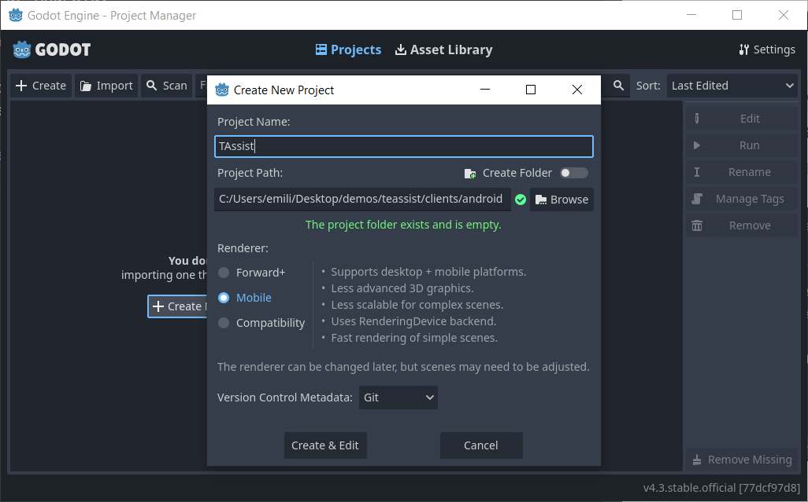
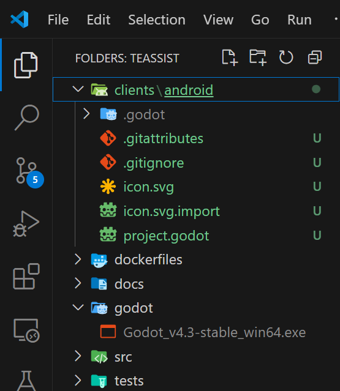
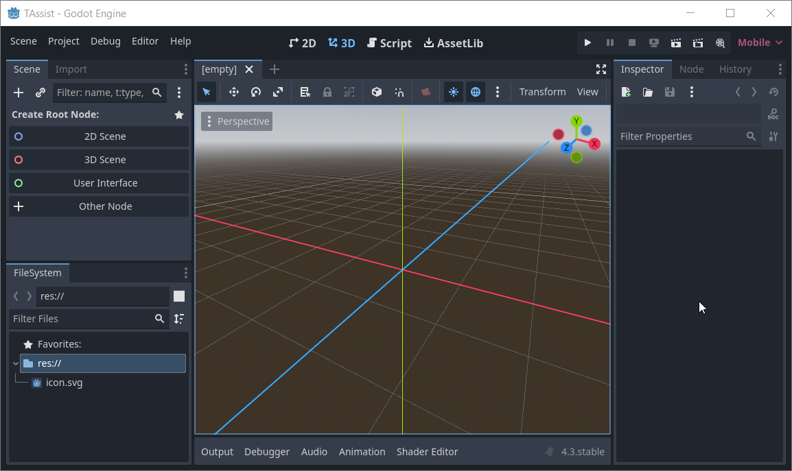
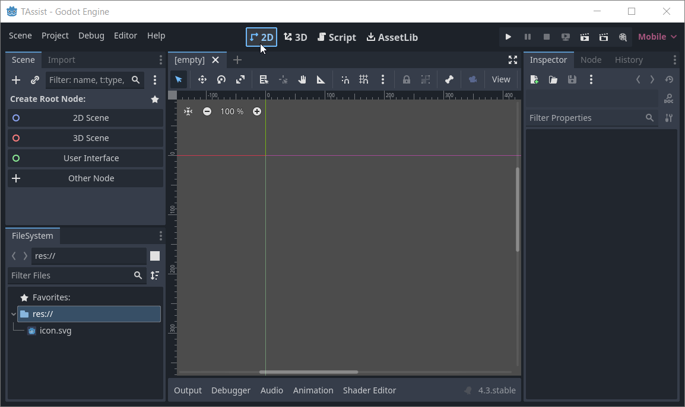

# Tutorial para crear un cliente de Godot para Android
En el proyecto Laravel, vamos a incluir el cliente de Godot para Android. Para ello, vamos a seguir los siguientes pasos:
## 1. Creamos dos carpetas por fuera de la carpeta de Laravel
La carpeta `godot` que contendrá la versión del motor de Godot que vamos a utilizar y la carpeta `clients\android` que contendrá el proyecto de Android.

Observa que hemos agregado la carpeta `godot` y sus contenidos al ignore de git.

## 2. Ejecutamos Godot y creamos un nuevo proyecto
Creamos el proyecto en la carpata `clients\android` y le asignamos el nombre `TAssist`.

Configuramos el proyecto como Mobile, y dejamos que el control de versiones sea `Git`.

Al presionar el botón `Create & Edit`, se abrirá el editor de Godot, con lo que podremos ver el proyecto creado. Dado que estamos utilizando Visual Studio Code, podemos ver el conjunto de archivos que conforman el proyecto, en la carpeta `clients\android\TAssist`.

También podemos ver el proyecto en el editor de Godot.

## 3. Configuramos el proyecto de Godot
Nuestro cliente consiste en un cliente 2D, por lo que vamos a configurar el proyecto para que sea 2D.

