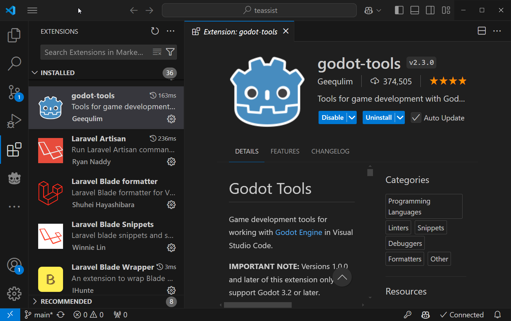
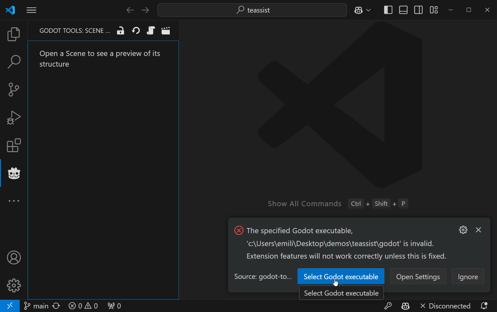
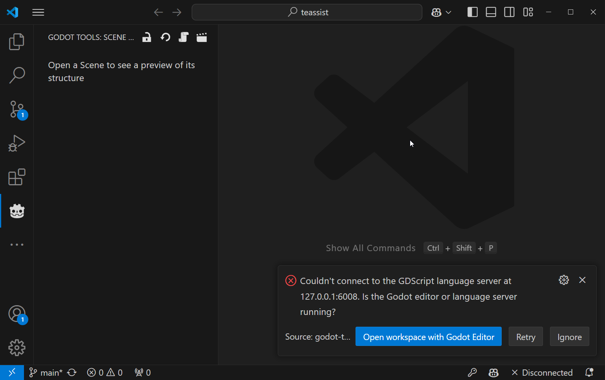
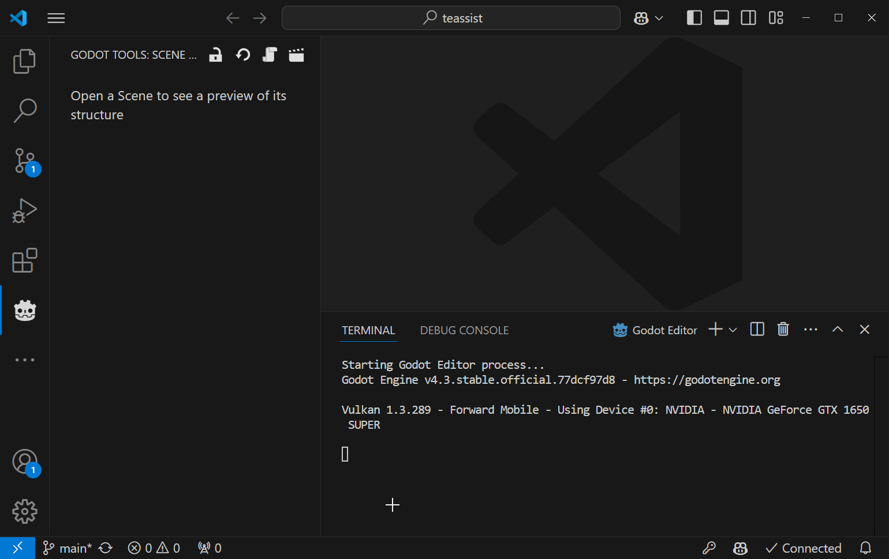

# Tutorial: Utilizando una extensión de Visual Studio Code para Godot Engine
En este tutorial aprenderás a utilizar una extensión de Visual Studio Code para Godot Engine, la cual te permitirá trabajar con Godot Engine de una manera más eficiente y cómoda.

La extensión que utilizaremos se llama `Godot Tools` y la puedes encontrar en el siguiente enlace: [Godot Tools](https://marketplace.visualstudio.com/items?itemName=geequlim.godot-tools).

## Características
Te haré un resumen de las características principales de la extensión "Godot Tools" para Visual Studio Code:

Características Principales:

1. Soporte para GDScript (.gd):
- Resaltado de sintaxis
- Autocompletado de código
- Navegación mediante ctrl+click para ir a definiciones
- Vista previa al pasar el cursor (hover)
- Formateador de código incorporado
- Soporte completo para GDScript tipado
- Modo "Smart" opcional para scripts dinámicamente tipados
- Visualización de errores y advertencias
- Cambio rápido entre archivos .gd y .tscn relacionados

2. Depurador de GDScript:
- Configuración simplificada (funciona con F5)
- Objetivos de lanzamiento convenientes
- Soporte para puntos de interrupción
- Control de excepciones
- Funciones paso a paso (step-in/out/over)
- Observación de variables
- Pila de llamadas
- Árbol de escena activo
- Inspector

3. Soporte para archivos de recursos (.tscn y .tres):
- Resaltado de sintaxis
- Navegación mediante ctrl+click
- Vista previa de recursos externos y subrecursos
- Vista previa de escena en el editor

4. Soporte para shaders (.gdshader):
- Resaltado de sintaxis

Es importante notar que:
- Es compatible con Godot 4
- Requiere Godot 3.2 o superior
- Las versiones 1.0.0 y posteriores solo son compatibles con Godot 3.2 o superior
- La extensión es gratuita y de código abierto
- Permite configurar VS Code como editor de scripts predeterminado para Godot

Esta extensión es una herramienta muy completa para desarrolladores que prefieren usar Visual Studio Code para trabajar con proyectos de Godot.

## Instalación

Una vez instalada la versión, ésta requiere la ubicación del ejecutable de Godot Engine. Para ello, debes ir a la configuración de la extensión y en la sección de `Godot: Executable Path` debes seleccionar la ubicación del ejecutable de Godot Engine.

Selecciona la ubicación del ejecutable de Godot Engine que previamente descargaste en la carpeta `godot` de tu proyecto. Posteriormente la extensión necesita reiniciarse para aplicar los cambios. Para ello, cierra Visual Studio Code y vuelve a abrirlo.

Una vez reiniciado Visual Studio Code, podrás ver que la extensión ha cargado correctamente. Sin embargo, necesita acceder al servicio de lenguaje del motor Godot, por lo que éste debe estar activo. Para ello, abre Godot Engine.

Una vez que hayas presionado el botón "Open workspace with Godot Editor", la extensión de Visual Studio Code se conectará al servicio de lenguaje de Godot Engine y podrás comenzar a trabajar con Godot Engine de una manera más eficiente y cómoda.

