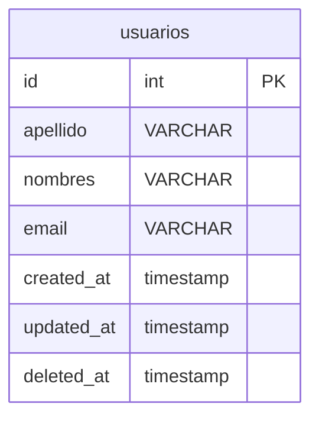
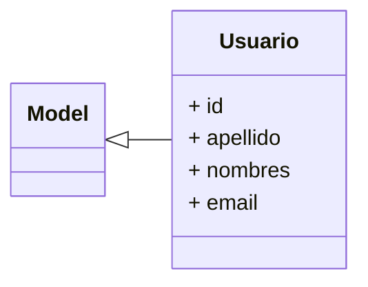

# Migraciones en Laravel (Teoría)

## **Objetivo**

El objetivo de esta clase es que comprendas los fundamentos de las migraciones en Laravel, sus principales componentes y herramientas, así como aprender a trabajar con modelos y relaciones mediante ejemplos prácticos.

## **Introducción**
El proyecto que se desarrollará a lo largo de este curso se basa en [Laravel Breeze](https://laravel.com/docs/11.x/starter-kits#laravel-breeze), un paquete oficial de Laravel que facilita la configuración de autenticación básica en proyectos Laravel. Laravel Breeze incluye las rutas, controladores y vistas necesarias para implementar la autenticación, así como la integración con [Tailwind CSS](https://tailwindcss.com/) y [Blade](https://laravel.com/docs/11.x/blade), lo que permite personalizar y adaptar la apariencia de la aplicación.

## **Migraciones en Laravel**
Las migraciones permiten definir y modificar la estructura de la base de datos usando código. Algunos aspectos fundamentales son:
- Controlan la versión de la base de datos.
- Facilitan la colaboración entre desarrolladores.
- Automatizan la creación y actualización de tablas.
- Son clases que definen las estructuras de tablas, índices y relaciones.

## **Seeders en Laravel**
Los seeders son clases que permiten insertar datos en la base de datos. Se utilizan para poblar la base de datos con datos de prueba o iniciales.

### Comandos `artisan`
Artisan es la interfaz de línea de comandos (CLI) de Laravel, y ofrece una variedad de comandos para trabajar con migraciones y seeders. Los comandos más importantes para migraciones y seeders son:
- `php artisan make:migration`: Crea una nueva migración.
    - por ejemplo: `php artisan make:migration create_usuarios_table`
- `php artisan migrate`: Ejecuta todas las migraciones pendientes.
- `php artisan migrate:rollback`: Revierte la última migración.
    - Puede especificarse el número de migraciones a revertir.
    - Por ejemplo, `php artisan migrate:rollback --step=3` revierte las últimas 3 migraciones.
- `php artisan migrate:reset`: Revierte todas las migraciones.
- `php artisan migrate:refresh`: Refresca la base de datos, volviendo a ejecutar todas las migraciones.
    - Puede agregarse el parámetro `--seed` para ejecutar los seeders.
- `php artisan db:seed`: Ejecuta los seeders configurados.
    - Puede especificarse el nombre del seeder a ejecutar. Por ejemplo, `php artisan db:seed --class=UsuariosSeeder`.

> :speech_balloon: **Nota**: Los comandos `migrate:rollback`, `migrate:reset` y `migrate:refresh` pueden ser peligrosos en producción, ya que pueden eliminar datos importantes. Por lo tanto, es recomendable usarlos con precaución.

### **Callbacks en Migraciones**
Laravel ofrece callbacks que se ejecutan antes y después de las migraciones, como:
- `before()`: Se ejecuta antes de que la migración sea aplicada. Por ejemplo, para verificar si una tabla existe antes de crearla.
- `after()`: Se ejecuta después de aplicar la migración. Por ejemplo, para insertar datos en la tabla recién creada.

### **Métodos Importantes**
Los métodos más relevantes al trabajar con migraciones en Laravel incluyen:
- `create`: Define la creación de una tabla.
    - Su sintaxis es `Schema::create('nombre_tabla', function (Blueprint $table) { ... })`.
- `table`: Modifica una tabla existente.
    - Su sintaxis es `Schema::table('nombre_tabla', function (Blueprint $table) { ... })`.
- Tipos de datos: `string`, `integer`, `boolean`, `text`, `timestamp`, entre otros.
- Atributos: `nullable`, `default`, `unique`, `index`.
- Relaciones: `foreign`, `onDelete`, `onUpdate`.

Ejemplo:
```php
Schema::create('usuarios', function (Blueprint $table) {
    $table->id();
    $table->string('apellido');
    $table->string('nombres');
    $table->string('email')->unique();
    $table->timestamps(); // Crea `created_at` y `updated_at`.
    $table->softDeletes(); // Agrega `deleted_at` para soft deletes.
});
```
Al ser ejecutada, esta migración creará una tabla `usuarios` con los campos `id`, `apellido`, `nombres`, `email` y `timestamps`, donde `id` es la clave primaria e `email` es única. El método `timestamps`permite automatizar el seguimiento de las fechas, y horas de creación, y modificación, para lo cual agrega los campos `created_at` y `updated_at`. Por su parte, el método `softDeletes` permite implementar eliminaciones suaves, es decir, no se eliminan los registros de la base de datos, sino que se establece un campo `deleted_at` que indica la fecha y hora de eliminación.

> :speech_balloon: **Nota**: Los métodos `timestamps` y `softDeletes` son opcionales y pueden ser omitidos si no son requeridos.



### **Relación entre Migraciones y Modelos en Laravel**
Los modelos en Laravel son la representación de las tablas en la base de datos. Para cada ejemplo de migración que veremos, también se incluirá el modelo correspondiente.
Por ejemplo, para la migración anterior, que crea la tabla `usuarios`, se creará un modelo `Usuarios` que represente a esa tabla.
Los modelos en Laravel se encuentran en el directorio `app/Models` y heredan de la clase `Illuminate\Database\Eloquent\Model`. Éste, haciendo uso de los mecanismos de introspección y de inyección de dependencias de PHP, le permite a Laravel:
- inferir la estructura de la tabla a la que representa.
- haciendo uso de la convención de nombres, Laravel puede inferir la tabla a la que pertenece el modelo. Por ejemplo, si se tiene un modelo `Usuario`, Laravel asumirá que la tabla correspondiente es `usuarios`. Aquí, la convención de nombres es importante, ya que Laravel espera que los nombres de las tablas sean plurales y en minúsculas (en inglés).
- definir relaciones entre modelos.
- definir atributos y métodos de instancia y de clase.
- definir mutadores y accesores. Los mutadores permiten modificar los valores de los atributos antes de ser almacenados en la base de datos, mientras que los accesores permiten modificar los valores de los atributos antes de ser devueltos al usuario.



Con respecto a las relaciones entre modelos, Laravel ofrece una variedad de métodos para definir relaciones entre modelos, como `hasOne`, `hasMany`, `belongsTo`, `belongsToMany`, `morphTo`, `morphMany`, `morphToMany`, entre otros. Estos métodos permiten definir relaciones uno a uno, uno a muchos, muchos a muchos y polimórficas. En las siguientes secciones se presentan ejemplos de migraciones y modelos que representan estas relaciones.

#### *Practica Guiada 1. Migraciones y Modelos*
En esta práctica, crearemos migraciones y modelos para un sistema de gestión de usuarios, perfiles y roles. Se definirán las relaciones uno a uno, uno a muchos y muchos a muchos entre los modelos `Usuario`, `Perfil` y `Rol`.

Comenzamos creando las migraciones para los modelos `Usuario`, `Perfil` y `Rol`. Para ello, tenemos tres opciones:

1. Crear las migraciones y los modelos al mismo tiempo.
2. Crear las migraciones y luego los modelos.
3. Crear los modelos, las migraciones, los factories y los seeders.

Para crear las migraciones y los modelos al mismo tiempo, se ejecutan los siguientes comandos:

```bash
$ php artisan make:model Usuario -m
$ php artisan make:model Perfil -m
$ php artisan make:model Rol -m
```
Por otro lado, si se desean crear las migraciones primero y luego los modelos, ejecutamos los siguientes comandos:

```bash
$ php artisan make:migration create_usuarios_table
$ php artisan make:migration create_perfiles_table
$ php artisan make:migration create_roles_table

$ php artisan make:model Usuario
$ php artisan make:model Perfil
$ php artisan make:model Rol
```

Finalmente, si se desea crear los modelos, las migraciones, los factories y los seeders, se ejecutan los siguientes comandos:

```bash
$ php artisan make:model Usuario -fms
$ php artisan make:model Perfil -fms
$ php artisan make:model Rol -fms
```

> :speech_balloon: **Nota**: Para obtener más información sobre los flags, se puede ejecutar el comando `php artisan help make:model`.

#### **Relación Uno a Uno**

**Migraciones:**

```php
Schema::create('users', function (Blueprint $table) {
    $table->id();
    $table->string('name');
    $table->timestamps();
});

Schema::create('profiles', function (Blueprint $table) {
    $table->id();
    $table->foreignId('user_id')->constrained()->onDelete('cascade');
    $table->string('bio');
    $table->timestamps();
});
```

**Modelo User:**

```php
class User extends Model
{
    public function profile()
    {
        return $this->hasOne(Profile::class);
    }
}
```

**Modelo Profile:**

```php
class Profile extends Model
{
    public function user()
    {
        return $this->belongsTo(User::class);
    }
}
```

#### **Relación Uno a Muchos**

**Migraciones:**

```php
Schema::create('posts', function (Blueprint $table) {
    $table->id();
    $table->foreignId('user_id')->constrained()->onDelete('cascade');
    $table->string('title');
    $table->text('content');
    $table->timestamps();
});
```

**Modelo User:**

```php
class User extends Model
{
    public function posts()
    {
        return $this->hasMany(Post::class);
    }
}
```

**Modelo Post:**

```php
class Post extends Model
{
    public function user()
    {
        return $this->belongsTo(User::class);
    }
}
```

#### **Relación Muchos a Muchos**

**Migraciones:**

```php
Schema::create('roles', function (Blueprint $table) {
    $table->id();
    $table->string('name');
    $table->timestamps();
});

Schema::create('role_user', function (Blueprint $table) {
    $table->id();
    $table->foreignId('user_id')->constrained()->onDelete('cascade');
    $table->foreignId('role_id')->constrained()->onDelete('cascade');
    $table->timestamps();
});
```

**Modelo User:**

```php
class User extends Model
{
    public function roles()
    {
        return $this->belongsToMany(Role::class);
    }
}
```

**Modelo Role:**

```php
class Role extends Model
{
    public function users()
    {
        return $this->belongsToMany(User::class);
    }
}
```

#### **Relaciones Polimórficas en Laravel**
Las relaciones polimórficas permiten que un modelo se relacione con varios otros modelos mediante una única relación. Este tipo de relaciones es útil cuando se desea que un modelo, como un comentario, etiqueta, o imagen, pueda asociarse a múltiples modelos sin crear relaciones separadas para cada uno.

Existen dos tipos principales de relaciones polimórficas que en las siguientes secciones se describen.

##### **Relación Uno a Muchos (Polimórfica)**

**Migraciones:**

```php
Schema::create('comments', function (Blueprint $table) {
    $table->id();
    $table->text('content');
    $table->morphs('commentable');
    $table->timestamps();
});
```

**Modelo Comment:**

```php
class Comment extends Model
{
    public function commentable()
    {
        return $this->morphTo();
    }
}
```

**Uso del Modelo:**

```php
$post = Post::find(1);
$post->comments()->create(['content' => 'Comentario en un post.']);
```

##### **Relación Muchos a Muchos (Polimórfica)**

**Migraciones:**

```php
Schema::create('tags', function (Blueprint $table) {
    $table->id();
    $table->string('name');
    $table->timestamps();
});

Schema::create('taggables', function (Blueprint $table) {
    $table->id();
    $table->foreignId('tag_id')->constrained()->onDelete('cascade');
    $table->morphs('taggable');
    $table->timestamps();
});
```

**Modelo Tag:**

```php
class Tag extends Model
{
    public function posts()
    {
        return $this->morphedByMany(Post::class, 'taggable');
    }

    public function videos()
    {
        return $this->morphedByMany(Video::class, 'taggable');
    }
}
```

---

### **4. Ejemplos de Migraciones que Modifican Tablas Existentes**

Modificar tablas es una tarea común en el desarrollo. Aquí algunos ejemplos:

#### **Agregar Nuevas Columnas**

```php
Schema::table('users', function (Blueprint $table) {
    $table->string('phone')->nullable();
});
```

#### **Eliminar Columnas**

```php
Schema::table('users', function (Blueprint $table) {
    $table->dropColumn('phone');
});
```

#### **Modificar Columnas**

```php
Schema::table('users', function (Blueprint $table) {
    $table->string('email')->unique()->change();
});
```