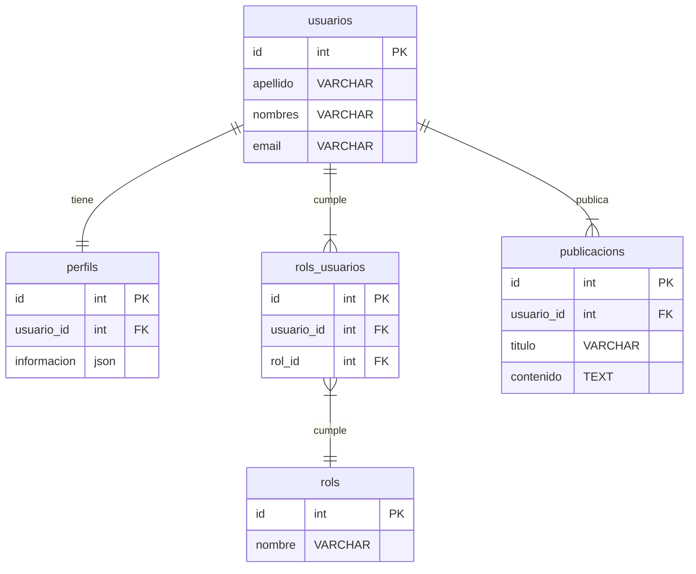

# Migraciones en Laravel

## Objetivo
El objetivo de esta clase es que comprendas los fundamentos de las migraciones en Laravel, sus principales componentes y herramientas, así como aprender a trabajar con modelos y relaciones mediante ejemplos prácticos.

## Contenido
1. [Introducción](#introducción)
2. [Conceptos escenciales](#conceptos-escenciales)
3. [Taller 1. Migraciones](#taller-1-migraciones)
4. [Taller 2. Modelos y Relaciones](#taller-2-modelos-y-relaciones)
5. [Taller 3. Seeders y Comandos Personalizados](#taller-3-seeders-y-comandos-personalizados)
6. [Taller 4. Listar Usuarios](#taller-4-listar-usuarios)
7. [Taller 5. Eliminar Usuarios](#taller-5-eliminar-usuarios)


## Introducción
El proyecto que se desarrollará a lo largo de este curso se basa en [Laravel Breeze](https://laravel.com/docs/11.x/starter-kits#laravel-breeze), un paquete oficial de Laravel que facilita la configuración de autenticación básica en proyectos Laravel. Laravel Breeze incluye las rutas, controladores y vistas necesarias para implementar la autenticación, así como la integración con [Tailwind CSS](https://tailwindcss.com/) y [Blade](https://laravel.com/docs/11.x/blade), lo que permite personalizar y adaptar la apariencia de la aplicación.

## Conceptos escenciales
Dado que esta clase es de índole práctico-teórica, realizaré a continuación una muy rápida introducción a los conceptos que se verán en esta clase. Más adelante, en la prácticas guiadas (talleres), se irán profundizando en estos conceptos.

### Modelos
Los modelos en Laravel son clases que representan tablas en la base de datos. Los modelos en Laravel se encuentran en el directorio `app/Models` y heredan de la clase `Illuminate\Database\Eloquent\Model`. Los modelos permiten:
- Definir relaciones entre modelos.
- Definir atributos y métodos de instancia y de clase.
- Definir mutadores y accesores.
- Definir relaciones polimórficas.

### Relaciones
Las relaciones en Laravel permiten definir cómo se relacionan los modelos entre sí. Algunos tipos de relaciones son:
- Uno a uno.
- Uno a muchos.
- Muchos a muchos.
- Polimórficas.

### Tablas
Las tablas en Laravel son estructuras de base de datos que almacenan información. Las tablas se definen mediante migraciones y se representan mediante modelos.

### Factories
Los factories son clases que permiten encapsular la creación de registros en la base de datos.

### Migraciones
Las migraciones en Laravel permiten definir y modificar la estructura de la base de datos usando código. Algunos aspectos fundamentales de las migraciones son:
- Controlan la versión de la base de datos.
- Facilitan la colaboración entre desarrolladores.
- Automatizan la creación y actualización de tablas.
- Son clases que definen las estructuras de tablas, índices y relaciones.

### Seeders
Los seeders en Laravel son clases que permiten insertar datos en la base de datos. Se utilizan para poblar la base de datos con datos de prueba o iniciales.

### Comandos `artisan`
Artisan es la interfaz de línea de comandos (CLI) de Laravel, y ofrece una variedad de comandos para trabajar con migraciones y seeders. Los comandos más importantes para migraciones y seeders son:
- `php artisan make:migration`: Crea una nueva migración.
    - por ejemplo: `php artisan make:migration create_usuarios_table`
- `php artisan migrate`: Ejecuta todas las migraciones pendientes.
- `php artisan migrate:rollback`: Revierte la última migración.
    - Puede especificarse el número de migraciones a revertir.
    - Por ejemplo, `php artisan migrate:rollback --step=3` revierte las últimas 3 migraciones.
- `php artisan migrate:reset`: Revierte todas las migraciones.
- `php artisan migrate:refresh`: Refresca la base de datos, volviendo a ejecutar todas las migraciones.
    - Puede agregarse el parámetro `--seed` para ejecutar los seeders.
- `php artisan db:seed`: Ejecuta los seeders configurados.
    - Puede especificarse el nombre del seeder a ejecutar. Por ejemplo, `php artisan db:seed --class=UsuariosSeeder`.

> :speech_balloon: **Nota**: Los comandos `migrate:rollback`, `migrate:reset` y `migrate:refresh` pueden ser peligrosos en producción, ya que pueden eliminar datos importantes. Por lo tanto, es recomendable usarlos con precaución.

## Taller 1. Migraciones
En esta práctica, crearemos migraciones y modelos para un sistema de gestión de usuarios, perfiles y roles. Se definirán las relaciones uno a uno, uno a muchos y muchos a muchos entre los modelos `Usuario`, `Publicación`, `Perfil` y `Rol`.


En términos de base de datos, se crearán las siguientes tablas y relaciones:

> :speech_balloon: **Nota**: En este ejemplo, deberá tener en cuenta que laravel para asociar modelos con tablas, aplica por defecto las reglas de plural y singular en inglés. Por ejemplo, el modelo `Usuario` se relaciona con la tabla `usuarios`, el modelo `Rol` se relaciona con la tabla `rols` (no `roles`), mientras que el modelo `Perfil` se asocia con `perfils` (no `perfiles`). Sin embargo, esto puede personalizarse si es necesario.
### Los comandos `artisan`
Comenzamos creando las migraciones para los modelos `Usuario`, `Perfil` `Publicacion` y `Rol`. Para ello, tenemos tres opciones:

1. Crear las migraciones y los modelos al mismo tiempo.
2. Crear las migraciones y luego los modelos.
3. Crear los modelos, las migraciones, los factories y los seeders.

Para crear las migraciones y los modelos al mismo tiempo, se ejecutan los siguientes comandos:

```bash
$ php artisan make:model Usuario -m
$ php artisan make:model Perfil -m
$ php artisan make:model Rol -m
$ php artisan make:model Publicacion -m
```
Por otro lado, si se desean crear las migraciones primero y luego los modelos, ejecutamos los siguientes comandos:

```bash
$ php artisan make:migration create_usuarios_table
$ php artisan make:migration create_perfiles_table
$ php artisan make:migration create_roles_table
$ php artisan make:migration create_publicaciones_table

$ php artisan make:model Usuario
$ php artisan make:model Perfil
$ php artisan make:model Rol
```

Finalmente, si se desea crear los modelos, las migraciones, los factories y los seeders, se ejecutan los siguientes comandos:

```bash
$ php artisan make:model Usuario -fms
$ php artisan make:model Perfil -fms
$ php artisan make:model Rol -fms
$ php artisan make:model Publicacion -fms
```

> :speech_balloon: **Nota**: Para obtener más información sobre los flags, se puede ejecutar el comando `php artisan help make:model`.

### Ejecución
Optamos por la última opción, y creamos los modelos, las migraciones, los factories y los seeders para los modelos `Usuario`, `Perfil` y `Rol`. A continuación, se presentan los comandos ejecutados:

```bash
$ php artisan make:model Usuario -fms
...
$ php artisan make:model Perfil -fms
...
$ php artisan make:model Rol -fms
...
$ php artisan make:model Publicacion -fms

```

> :speech_balloon: **Nota**: IMPORTANTE! Los modelos DEBEN nombrarse en singular, en inglés y en CamelCase.

Estos comandos crean las clases `Usuario`, `Publicacion`, `Perfil` y `Rol` en el directorio `app/Models`, así como las migraciones en el directorio `database/migrations`. Además, se crean los factories en el directorio `database/factories` y los seeders en el directorio `database/seeders`.

A continuación, analizaremos el código de las migraciones, los modelos, los factories y los seeders que fueron generados.

#### Código de Migraciones
Si tomamos como ejemplo la migración `create_usuarios_table.php`, podemos observar que la migración define el siguiente código.

```php
<?php

use Illuminate\Database\Migrations\Migration;
use Illuminate\Database\Schema\Blueprint;
use Illuminate\Support\Facades\Schema;

return new class extends Migration
{
    /**
     * Run the migrations.
     */
    public function up(): void
    {
        Schema::create('usuarios', function (Blueprint $table) {
            $table->id();
            $table->timestamps();
        });
    }

    /**
     * Reverse the migrations.
     */
    public function down(): void
    {
        Schema::dropIfExists('usuarios');
    }
};
```
En primer lugar vemos dos métodos callback: `up()` y `down()`:
- `up()`: Se ejecuta al aplicar la migración.
- `down()`: Se ejecuta al revertir la migración.

Además, laravel ofrece otros métodos callback como `before()` y `after()` que permiten ejecutar código antes y después de aplicar la migración.
- `before()`: Se ejecuta antes de que la migración sea aplicada. Por ejemplo, para verificar si una tabla existe antes de crearla.
- `after()`: Se ejecuta después de aplicar la migración. Por ejemplo, para insertar datos en la tabla recién creada.

Si ahora hacemos foco en el método `up()`, vemos que para crear una tabla, utiliza el método `Schema::create()`. Describimos a continuación, éste y otros métodos importantes de `Blueprint` y `Schema`.

#### Métodos importantes de `Blueprint` y `Schema`
Los métodos más relevantes al trabajar con migraciones en Laravel incluyen:
- `Schema::create()`: Define la creación de una tabla.
    - Su sintaxis es `Schema::create('nombre_tabla', function (Blueprint $table) { ... })`.
- `Schema::table()`: Modifica una tabla existente.
    - Su sintaxis es `Schema::table('nombre_tabla', function (Blueprint $table) { ... })`.
- Tipos de datos:
    - `$table->string()`,
    - `$table->integer()`,
    - `$table->decimal()`,
    - `$table->date()`,
    - `$table->text()`,
    - `$table->json()`,
    - `$table->boolean()`, entre otros.
- Atributos:
    - `$table->nullable()`,
    - `$table->default(...)`,
    - `$table->unique()`,
    - `$table->index()`.
- Relaciones: `foreign`, `onDelete`, `onUpdate`.
- `$blueprint->dropColumn()`: Elimina una columna.
- `Schema::drop()`: Elimina una tabla.
- `Schema::dropIfExists()`: Elimina una tabla si existe.
- `$blueprint->timestamps()`: Crea los campos `created_at` y `updated_at`.
- `$blueprint->softDeletes()`: Crea el campo `deleted_at` para soft deletes, el cual indica la fecha y hora de eliminación, o `null` si no está eliminado.

#### Actividad 1. Crear las Migraciones
1. Completa las migraciones para los modelos `Perfil`, `Publicacion` y `Rol`. Asegúrate de definir los atributos correspondientes. Por ejemplo, en el siguiente código se agregan `apellido`, `nombres` y `email` a la tabla `usuarios`.
```php
Schema::create('usuarios', function (Blueprint $table) {
    $table->id();
    $table->string('apellido');
    $table->string('nombres');
    $table->string('email')->unique();
});
```
2. Ejecuta las migraciones con el comando
`php artisan migrate`.
3. Prueba que las tablas `usuarios`, `perfils` y `rols` se hayan creado correctamente en la base de datos.
4. Revierte las migraciones con el comando:
`php artisan migrate:rollback`.
5. Verifica que las tablas `usuarios`, `perfils` y `rols` se hayan eliminado correctamente de la base de datos.
6. Vuelve a ejecutar las migraciones con el comando:
`php artisan migrate`.
7. Utiliza el comando `php artisan fresh` para eliminar y volver a crear todas las tablas de la base de datos.

> :speech_balloon: **Nota**: El comando `php artisan fresh` es equivalente a ejecutar `php artisan migrate:refresh --seed`. Puedes ver el código fuente de este comando en `src/routes/console.php`.

8. Agrega ahora los timestamps y los softDeletes a todas las migraciones.
9. Ejecuta las migraciones con el comando `php artisan migrate`. Piensa qué puede significar el mensaje `Nothing to migrate`.
10. ¿Qué deberías ejecutar para que las migraciones se apliquen correctamente?

> :speech_balloon: **Nota**: Como podrás ver, los métodos `timestamps` y `softDeletes` son opcionales y pueden ser omitidos si no son requeridos.

La siguiente tabla muestra el resultado esperado de la actividad respecto a la tabla `usuarios` y similar para las tablas `perfils` y `rols`.


## Taller 2. Modelos y Relaciones
### Sobre los Modelos
Los modelos en Laravel se encuentran en el directorio `app/Models` y heredan de la clase `Illuminate\Database\Eloquent\Model`. Éste, haciendo uso de los mecanismos de introspección y de inyección de dependencias de PHP, le permite a Laravel:
- inferir la estructura de la tabla a la que representa.
- haciendo uso de la convención de nombres, Laravel puede inferir la tabla a la que pertenece el modelo. Por ejemplo, si se tiene un modelo `Usuario`, Laravel asumirá que la tabla correspondiente es `usuarios`. Aquí, la convención de nombres es importante, ya que Laravel espera que los nombres de las tablas sean plurales y en minúsculas (en inglés).
- definir relaciones entre modelos.
- definir atributos y métodos de instancia y de clase.
- definir mutadores y accesores.
    - Los *mutadores* permiten modificar los valores de los atributos antes de ser almacenados en la base de datos, mientras que los
    - *accesores* permiten modificar los valores de los atributos antes de ser devueltos al usuario.


### Relaciones
Con respecto a las relaciones entre modelos, Laravel ofrece una variedad de métodos para definir relaciones entre modelos, como:
- `hasOne`,
- `hasMany`,
- `belongsTo`,
- `belongsToMany`,
- `morphTo`,
- `morphMany`,
- `morphToMany`, entre otros.

### Relación Uno a Uno
En general, las relaciones se definen tanto en las migraciones como en los modelos.
Para definir una relación uno a uno entre los modelos `Usuario` y `Perfil`, se puede hacer uso del método `hasOne()` en el modelo `Usuario` y del método `belongsTo()` en el modelo `Perfil`.
Por su parte, en la migración de la tabla `perfils`, se debe agregar una columna `usuario_id` que haga referencia al `id` de la tabla `usuarios`. Para ello, se puede hacer uso del método `foreignId` con el método `constrained` y el método `onDelete('cascade')`.


### Migraciones
Para agregar la columna, podemos crear una nueva migración o modificar la migración existente de la tabla `perfils`. A continuación, se muestra un ejemplo de cómo agregar la columna `usuario_id` a la tabla `perfils`.

> :speech_balloon: **Nota**: Para agregar una columna a una tabla existente, se debe crear una nueva migración. No se debería modificar la migración original, ya que esto podría causar problemas al trabajar en equipo. Sin embargo, en el contexto de este taller, somos libres de modificar las migraciones existentes y ejecutar `php artisan fresh`.

```bash
$ php artisan make:migration add_usuario_id_to_perfils_table
```

```php
<?php

use Illuminate\Database\Migrations\Migration;
use Illuminate\Database\Schema\Blueprint;
use Illuminate\Support\Facades\Schema;

return new class extends Migration
{
    /**
     * Run the migrations.
     */
    public function up(): void
    {
        Schema::table('perfils', function (Blueprint $table) {
            $table->foreignId('usuario_id')->constrained()->onDelete('cascade');
        });
    }

    /**
     * Reverse the migrations.
     */
    public function down(): void
    {
        Schema::table('perfils', function (Blueprint $table) {
            $table->dropForeign(['usuario_id']);
        });
    }
};
```
En este ejemplo, se utiliza el método `constrained` para definir una clave foránea que hace referencia al `id` de la tabla `usuarios`. Además, se utiliza el método `onDelete('cascade')` para definir la acción a realizar en caso de eliminación de un usuario.

El método `constrained()` hace que la columna sea una clave foránea que hace referencia al `id` de la tabla `usuarios`, y asegura que cualquier valor en la columna `usuario_id` exista en la columna `id` de la tabla `usuarios`.

También se puede utilizar el método `onUpdate('cascade')` para definir la acción a realizar en caso de actualización de un usuario.

Por otro lado, se utiliza el método `dropForeign` para eliminar la clave foránea. Recuerda que el método `down` se ejecuta al revertir la migración, y debe deshacer los cambios realizados en el método `up`.

### Modelos

```php
class Usuario extends Model
{
    public function perfil()
    {
        return $this->hasOne(Perfil::class);
    }
}

class Perfil extends Model
{
    public function user()
    {
        return $this->belongsTo(User::class);
    }
}
```
### Actividad 2. Crear las Relaciones
1. Completa las relaciones uno a uno entre los modelos `Usuario` y `Perfil`.
2. Ejecuta las migraciones con el comando `php artisan migrate`.

## Taller 3. Seeders y Comandos Personalizados
### Ruta console.php
En el archivo `routes/console.php`, se pueden definir comandos personalizados que se ejecutan desde la consola. Por ejemplo, se pueden definir comandos para crear usuarios con sus perfiles.

Para ello, se puede utilizar el método `Artisan::command(nombre, función)` para definir un comando personalizado. Por ejemplo, se puede definir un comando para crear un usuario con su perfil.

```php
<?php
use App\Models\Usuario;
use App\Models\Perfil;

Artisan::command('usuario:crear', function () {
    $usuario = Usuario::factory()->create();
    $usuario->perfil()->create([
        'informacion' => "Información de $usuario->nombres",
    ]);
    $this->info("Usuario creado: $usuario->apellidos ($usuario->id)");
})->describe('Crea un nuevo usuario y perfil');
```
> :speech_balloon: **Nota**: En este ejemplo, se utiliza el método `factory()` para crear un usuario con datos aleatorios. Luego, se crea un perfil para el usuario con información personalizada. Finalmente, se muestra un mensaje con el apellido y el ID del usuario creado.

> :speech_balloon: **Nota**: Para ordenarnos con los nombres de los comandos, se recomienda utilizar el formato `nombre:acción`. Por ejemplo, `usuario:crear`, `usuario:eliminar`, `usuario:listar`.

Para ejecutar el comando, se utiliza el comando `php artisan usuario:crear`.

### Actividad 3. Crear un Comando Personalizado
1. Escribe el comando anterior en el archivo `routes/console.php`.
2. Ejecuta el comando `php artisan usuario:crear`.
3. Verifica que se haya creado un usuario con su perfil en la base de datos.

## Taller 4. Listar Usuarios
También se pueden definir comandos para listar usuarios y perfiles.

### Listar Usuarios
#### Método `Model::get()`
Eloquent proporciona el método `get()` para obtener todos los registros de una tabla.
#### Método `Model::all()`
Para listar usuarios, se puede definir un comando que obtenga todos los usuarios y muestre sus datos en una tabla. Eloquent proporciona el método `all()` para obtener todos los registros de una tabla. Este método devuelve una colección de modelos que se pueden mostrar en una tabla.
#### Método `Model::with()`
Para cargar relaciones, se puede utilizar el método `with()` de Eloquent. Por ejemplo, para cargar la relación `perfil` de los usuarios, se puede utilizar el método `with('perfil')`. Luego, se pueden obtener los datos con el método `get()` o `all()`.
#### Método `Artisan::table()`
Este método puede recibir un array con los nombres de las columnas que se desean mostrar en la tabla.
```php
// sintaxis de Artisan::table()
Artisan::table($headers, $data);
```
#### Seleccionar columnas con `map()`, `pluck()` y `only()`
Dado que n muchos casos no queremos mostrar todas las columnas podemos utilizar los métodos `map()`, `pluck()` y `only()`. A continuación mostramos las diferencias entre estos métodos.
##### Método `map( función )`
El método `map` itera a través de la colección y te permite modificar cada elemento, devolviendo una nueva colección con los elementos modificados.
```php
$usuarios = Usuario::all();
$nombresUsuarios = $usuarios->map(function ($usuario) {
    return [
        'id' => $usuario->id,
        'apellidos' => $usuario->apellidos,
        'nombres' => $usuario->nombres,
    ];
});
```
En este ejemplo, estamos creando una nueva colección que contiene id, apellidos y nombres de los usuarios. La variable `$nombresUsuarios` contendrá un arreglo con la siguiente estructura:
```php
[
    ['id' => 1, 'apellidos' => 'Pérez', 'nombres' => 'Juan'],
    ['id' => 2, 'apellidos' => 'Gómez', 'nombres' => 'María'],
    ...
]
```
##### Método `pluck( valor, clave )`
El método `pluck` recupera todos los valores de una clave determinada de la colección. Es un atajo conveniente para mapear una sola columna o clave.

```php
$usuarios = Usuario::all();
$nombresUsuarios = $usuarios->pluck('nombres','id');
```
Esto te retornará una colección con nombres e identificadores de los usuarios. En este caso, la variable `$nombresUsuarios` contendrá un arreglo con la siguiente estructura:
```php
[
    1 => 'Juan',
    2 => 'María',
    ...
]
```
 - Similitudes:
    1. Los dos métodos devuelven una nueva colección.
    2. Todos pueden ser usados para transformación o filtrado de datos.
 - Diferencias:
    1. `map()` es el más flexible, permitiéndote realizar transformaciones complejas en cada elemento.
    2. `pluck()` es específicamente para extraer una sola columna o clave de cada elemento.

```php
Artisan::command('usuario:listar-solo', function () {
    $this->info('Usando map()');
    $usuarios = Usuario::all()->map(function ($usuario) {
        return [
            'id' => $usuario->id,
            'apellidos' => $usuario->apellidos,
            'nombres' => $usuario->nombres,
        ];
    });
    $this->line(json_encode($usuarios, JSON_PRETTY_PRINT | JSON_UNESCAPED_UNICODE));
    $this->info('Usando pluck()');
    $usuarios = Usuario::all()->pluck('apellidos', 'id');
    $this->line(json_encode($usuarios, JSON_PRETTY_PRINT | JSON_UNESCAPED_UNICODE));
})->describe('Lista los usuarios que no tienen perfil');
```

#### Seleccionar filas con `where()`, `orWhere()` y `like`
El método `where()` permite filtrar los registros de una tabla en función de una condición. Por ejemplo, para listar los usuarios cuyo apellido, nombre o email contenga una cadena específica, se puede utilizar el método `where()`, seguido de `like` y `%cadena%`.

```php
$search = 'per'; // cadena a buscar
$usuarios = Usuario::where('apellidos', 'like', "%$search%")
    ->orWhere('nombres', 'like', "%$search%")
    ->get()->map(function ($usuario) {
        return [
            'id' => $usuario->id,
            'apellidos' => $usuario->apellidos,
            'nombres' => $usuario->nombres,
        ];
    });
```
#### Actividad 4. Listar Usuarios
1. Escribe el comando anterior en el archivo `routes/console.php`.
2. Ejecuta el comando `php artisan usuario:listar`.
3. Agrega a la tabla, la información de los perfiles de los usuarios. Para ello, puedes utilizar el método `with()` de Eloquent para cargar la relación `perfil` de los usuarios. Además, puedes limitar la cantidad de caracteres del campo perfil para que se muestre en la tabla y agregar `...` al final del texto si es necesario.

## Taller 5. Eliminar Usuarios
Para eliminar usuarios, se requieren dos pasos:
1. Buscar el usuario por su ID.
2. Eliminar el usuario si se encuentra.
#### Método `Model::find()`
Se puede utilizar el método `find()` de Eloquent para buscar un usuario por su ID. Si el usuario se encuentra, se puede eliminar utilizando el método `delete()`. Por el contrario, si el usuario no se encuentra, el valor devuelto será `null`.
#### Método `Model::delete()`
Este método elimina el modelo de la base de datos. Si el modelo se elimina correctamente, el método devuelve `true`. De lo contrario, devuelve `false`.
#### Parámetros en comandos de Artisan
Los comandos de Artisan pueden recibir parámetros y opciones. Los parámetros se definen entre llaves `{}` y las opciones se definen con el prefijo `--`. Por ejemplo, en el comando `php artisan eliminar:usuario {id}`, `id` es un parámetro, mientras que en el comando `php artisan usuario:listar --id=1`, `id` es una opción.

```php
Artisan::command('usuario:eliminar {id}', function ($id) {
    $usuario = Usuario::find($id);
    if ($usuario) {
        $usuario->delete();
        $this->info("Usuario $id eliminado.");
    } else {
        $this->error('Usuario no encontrado');
    }
})->describe('Elimina un usuario por ID');
```

#### Actividad 5. Eliminar Usuarios
1. Escribe el comando anterior en el archivo `routes/console.php`.
2. Ejecuta el comando `php artisan eliminar:usuario {id}` con un ID válido.
3. Verifica que el usuario se haya eliminado correctamente.
4. Ejecuta el comando `php artisan eliminar:usuario {id}` con un ID inválido.
5. En el comando verifica que el parámtero `id` es un número entero y no nulo. En caso contrario, muestra un mensaje de error.

#### Relación Uno a Muchos
La única diferencia entre una relación uno a uno y una relación uno a muchos es que en una relación uno a muchos, el modelo principal tiene muchos modelos secundarios. Por ejemplo, un usuario puede tener muchos posts, pero un post solo puede tener un usuario.
En este caso, se puede definir una relación uno a muchos entre los modelos `Usuario` y `Publicacion`. Para ello, se puede hacer uso del método `hasMany()` en el modelo `Usuario` y del método `belongsTo()` en el modelo `Publicacion`.

**Migraciones:**

```php
Schema::create('publicacions', function (Blueprint $table) {
    $table->id();
    $table->foreignId('user_id')->constrained()->onDelete('cascade');
    $table->string('titulo');
    $table->text('contenido');
    $table->timestamps();
});
```

**Modelo User:**

```php
class Usuario extends Model
{
    public function perfil() : BelongsTo
    {
        return $this->hasOne(Perfil::class);
    }
    {
        return $this->hasMany(Publicacion::class);
    }
}
```

**Modelo Publicacion:**

```php
class Publicacion extends Model
{
    public function usuario() : BelongsTo
    {
        return $this->belongsTo(Usuario::class);
    }
}
```

#### **Relación Muchos a Muchos**

**Migraciones:**

```php
Schema::create('roles', function (Blueprint $table) {
    $table->id();
    $table->string('name');
    $table->timestamps();
});

Schema::create('role_user', function (Blueprint $table) {
    $table->id();
    $table->foreignId('user_id')->constrained()->onDelete('cascade');
    $table->foreignId('role_id')->constrained()->onDelete('cascade');
    $table->timestamps();
});
```

**Modelo User:**

```php
class User extends Model
{
    public function roles()
    {
        return $this->belongsToMany(Role::class);
    }
}
```

**Modelo Role:**

```php
class Role extends Model
{
    public function users()
    {
        return $this->belongsToMany(User::class);
    }
}
```
Existen dos tipos principales de relaciones polimórficas que en las siguientes secciones se describen.

## Migraciones que Modifican Tablas

Modificar tablas es una tarea común en el desarrollo. Aquí algunos ejemplos:

### Agregar Nuevas Columnas

```php
Schema::table('users', function (Blueprint $table) {
    $table->string('phone')->nullable();
});
```

### Eliminar Columnas

```php
Schema::table('users', function (Blueprint $table) {
    $table->dropColumn('phone');
});
```

### Modificar Columnas

```php
Schema::table('users', function (Blueprint $table) {
    $table->string('email')->unique()->change();
});
```