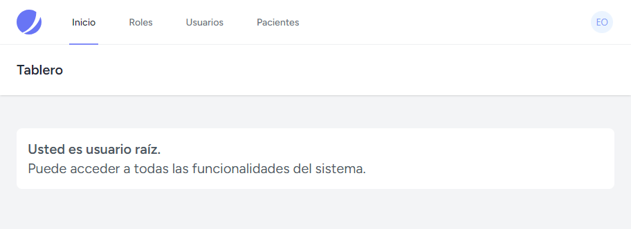
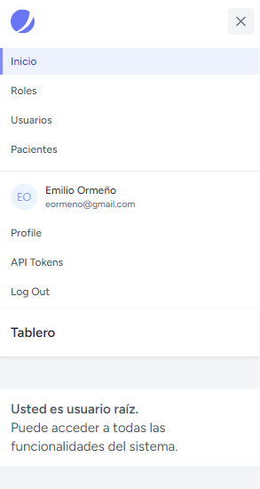

### Tutorial: Agregar Nuevos Ítems al Menú de Navegación en Laravel

En este tutorial, aprenderemos cómo agregar nuevos ítems al menú de navegación en una aplicación Laravel. Seguiremos los cambios registrados en el archivo `navigation-menu.blade.php` y los implementaremos tanto en la versión web como en la versión responsive del menú.
La siguiente imagen muestra cómo debería verse la versión web del menú de navegación al finalizar este tutorial:

Por otro lado, la siguiente imagen muestra cómo debería verse la versión responsive del menú de navegación al finalizar este tutorial:


#### Paso 1: Cambiar el Nombre del Ítem "Dashboard" a "Inicio"

En la versión web del menú, cambiaremos el nombre del ítem "Dashboard" a "Inicio".

```php
<x-nav-link href="{{ route('dashboard') }}" :active="request()->routeIs('dashboard')">
    {{ __('Inicio') }}
</x-nav-link>
```

En la versión responsive del menú, realizamos el mismo cambio:

```php
<x-responsive-nav-link href="{{ route('dashboard') }}" :active="request()->routeIs('dashboard')">
    {{ __('Inicio') }}
</x-responsive-nav-link>
```

#### Paso 2: Agregar Ítem "Roles" al Menú

En la versión web del menú, agregamos un nuevo ítem para "Roles":

```php
<div class="hidden space-x-8 sm:-my-px sm:ms-10 sm:flex">
    <x-nav-link href="{{ route('roles.index') }}" :active="request()->routeIs('roles.index')">
        {{ __('Roles') }}
    </x-nav-link>
</div>
```

En la versión responsive del menú, agregamos el mismo ítem:

```php
<x-responsive-nav-link href="{{ route('roles.index') }}" :active="request()->routeIs('roles.index')">
    {{ __('Roles') }}
</x-responsive-nav-link>
```

#### Paso 3: Agregar Ítem "Usuarios" al Menú

En la versión web del menú, agregamos un nuevo ítem para "Usuarios":

```php
<div class="hidden space-x-8 sm:-my-px sm:ms-10 sm:flex">
    <x-nav-link href="{{ route('users.index') }}" :active="request()->routeIs('users.index')">
        {{ __('Usuarios') }}
    </x-nav-link>
</div>
```

En la versión responsive del menú, agregamos el mismo ítem:

```php
<x-responsive-nav-link href="{{ route('users.index') }}" :active="request()->routeIs('users.index')">
    {{ __('Usuarios') }}
</x-responsive-nav-link>
```

#### Actividad de Práctica: Agregar Ítem "Pacientes" al Menú

Ahora, como actividad de práctica, agregarás un nuevo ítem para "Pacientes" tanto en la versión web como en la versión responsive del menú.

**Versión Web:**

1. Abre el archivo `navigation-menu.blade.php`.
2. Encuentra la sección donde se definen los ítems del menú.
3. Agrega el siguiente código para el ítem "Pacientes":

```php
<div class="hidden space-x-8 sm:-my-px sm:ms-10 sm:flex">
    <x-nav-link href="{{ route('patients.index') }}" :active="request()->routeIs('patients.index')">
        {{ __('Pacientes') }}
    </x-nav-link>
</div>
```

**Versión Responsive:**

1. En el mismo archivo `navigation-menu.blade.php`, encuentra la sección para el menú responsive.
2. Agrega el siguiente código para el ítem "Pacientes":

```php
<x-responsive-nav-link href="{{ route('patients.index') }}" :active="request()->routeIs('patients.index')">
    {{ __('Pacientes') }}
</x-responsive-nav-link>
```

#### Conclusión

Con estos pasos, hemos agregado nuevos ítems al menú de navegación en una aplicación Laravel. Asegúrate de probar los cambios tanto en la versión web como en la versión responsive para verificar que los nuevos ítems se muestran correctamente.